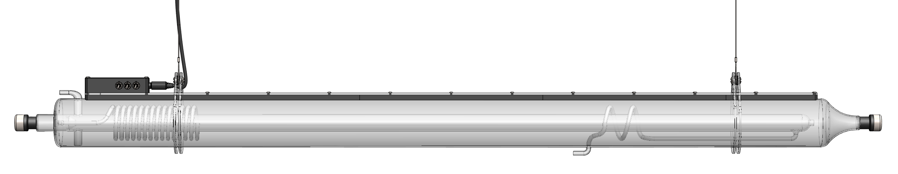
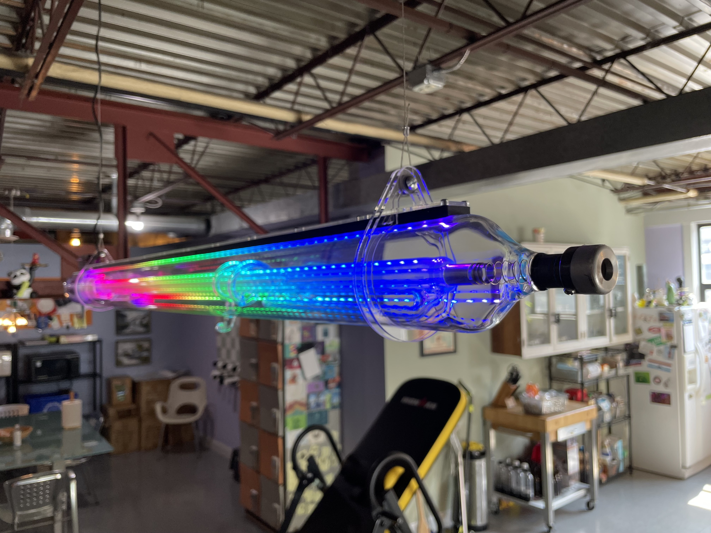
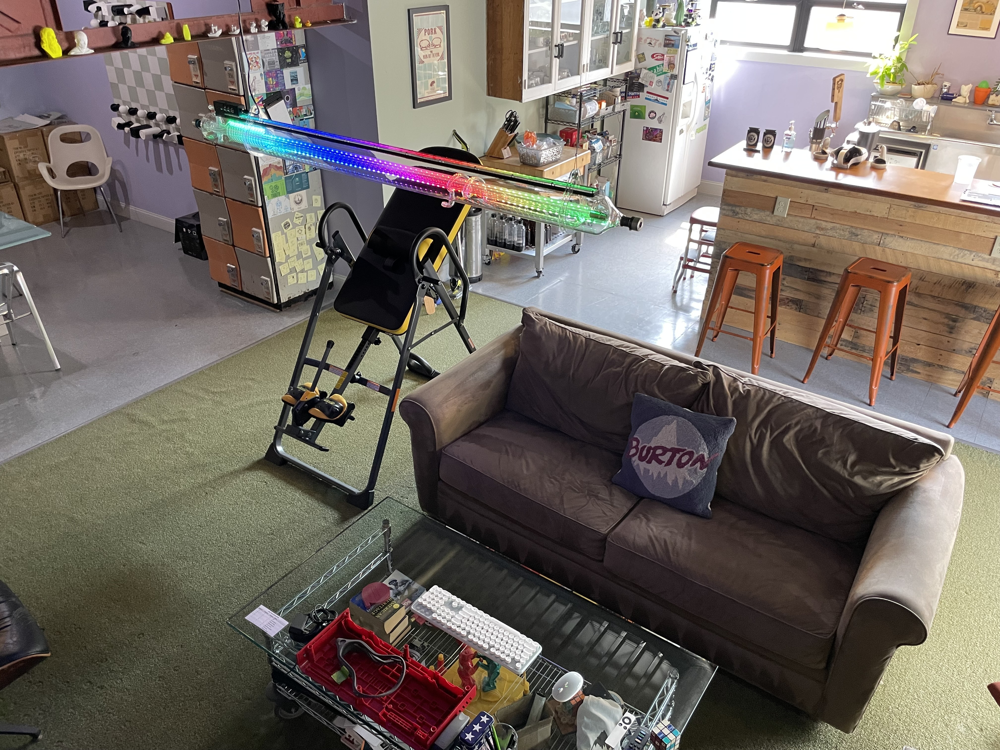

# Tool., Inc - Laser Tube Lamp

At Tool., Inc. our engineers and designers are constantly using our Lasersaur CNC laser cutter/engraver. Usually to rapidly produce project prototypes but occasionally to make furniture and pieces around the office. Unfortunately, the laser tube that makes the magic happen slowly degrades over time and needs to be replaced. So, what do you do with the old dead tube? It looks super cool so it feels bad to just throw it away. Why not turn it into a unique light fixture?! 

With the new laser tube installed in the machine, we cut a handful of 1/8" acrylic parts and got our Ultimaker 3D printers going on some PLA components. All the hardware is fairly standard and can be found at a local hardware store, or every mechanical engineer's favorite: McMaster-Carr. Using an Arduino and Adafruit NeoPixels, any light can go from plain white to fully custom and dynamic RGB lighting effects in the flick of a switch. Ours uses three toggle switches to select from up to eight preprogrammed lighting modes. We enlisted one of our summer interns to help turn the lighting animations into the 1s and 0s. 

Combine all that with an old 120W, 80mm diameter, 1450mm long, CO2 laser tube and you get a, slightly less destructive, 25W LED lamp. It makes a perfect addition to any shop, makerspace, studio, or employee kitchen and lounge. 

We've open-sourced the project so you too can DIY the most expensive lamp in your shop! This GitHub repository has the instructions, bill of materials, CAD files, and source code. The design was based around our laser tube and equipment but you can adjust it to fit your needs. 

## Lighting Modes
|Switch C|Switch B|Switch A|Mode|
|:---|:---|:---|:---|
|0|0|0|Off|
|0|0|1|Cool White|
|0|1|0|Warm White|
|0|1|1|Wave Bounce|
|1|0|0|Laser Build|
|1|0|1|Breathing Cycle|
|1|1|0|Fill Cycle|
|1|1|1|Rainbow Slide|

## Bill of Materials

### 3D Prints

|Part|File|Quantity|
|:---|:---|:---|
|Electronics Enclosure|electronics_enclosure.stl|1|
|Hanger Cable Pulley|hanger_cable_pully.stl|2|
|Strip (End)|strip_end.stl|2|
|Strip (Side)|strip_side.stl|6|

### Laser Cuts

|Part|File|Quantity|
|:---|:---|:---|
|Strip Backing|strip_back.dxf|1|
|Teardrop Hanger|teardrop_hanger.dxf|4|

### Hardware

|Part|SKU|Quantity|Link|
|:---|:---|:---|:---|
|M3 Heat Set Inserts|94459A140|26|[McMaster-Carr](https://www.mcmaster.com/94459A140/)|
|M3 x 8 mm Button Head Hex Drive Screw|92095A181|22|[McMaster-Carr](https://www.mcmaster.com/92095A181/)|
|M3 x 30 mm Button Head Hex Drive Screw|92095A187|4|[McMaster-Carr](https://www.mcmaster.com/92095A187/)|
|Binding Barrel|98002A202|2|[McMaster-Carr](https://www.mcmaster.com/98002A202/)|
|Wire Rope|3461T474|1|[McMaster-Carr](https://www.mcmaster.com/3461T474/)|
|Wire Rope Compression Sleeve|3896T61|4|[McMaster-Carr](https://www.mcmaster.com/3896T61/)|
|Foam Double Face Mounting Tape|3744A41|1|[McMaster-Carr](https://www.mcmaster.com/3744A41/)|

### Electronics

|Part|SKU|Quantity|Link|Notes|
|:---|:---|:---|:---|:---|
|Arduino Nano Every|ABX00028|1|[Arduino](https://store.arduino.cc/products/arduino-nano-every)|I'd recommend getting the version without headers to solder directly to the Arduino.|
|DC Power Supply (5V, 5A)|B078RT3ZPS|1|[Amazon](https://a.co/d/07ThTM0f)|Each NeoPixel can draw up to 60 mA. For my strip length, that's 4.26 amps!|
|DC Barrel Jack|B07CTCLKPP|1|[Amazon](https://a.co/d/05rNLqdA)||
|Toggle Switch|100SP1T1B1M1QEH|3|[DigiKey](https://www.digikey.com/en/products/detail/e-switch/100SP1T1B1M1QEH/378819)||
|NeoPixel Strip (2 m)|2540|1|[Adafruit](https://www.adafruit.com/product/2540)|To save a couple bucks, buying two 1 m strips can be cheaper.|
|Resistor (470 Ω)|CF14JT470R|1|[DigiKey](https://www.digikey.com/en/products/detail/stackpole-electronics-inc/CF14JT470R/1741440)||
|Capacitor (1,000 μF)|ECA-0JM102|1|[DigiKey](https://www.digikey.com/en/products/detail/panasonic-electronic-components/ECA-0JM102/244974)||

## Images

## Author
Jordan Tryon for tool., Inc.
